# Explorateur_fichiers
projet de programmation évènementielle
Documentation:
Les problèmes mentionnés ont leur solutions respectivement dans la section solution
*Problèmes rencontrés:
1-Difficultés pour le positionnement des éléments,mise en page grid(), notamment les concepts de row, column, sticky, rowconfigure, et columnconfigure. Savoir quand et comment utiliser sticky pour que les widgets s'étirent correctement
2-Le rôle des StringVar() pour lier les entrées de texte (tk.Entry) aux variables Python et comment récupérer ou modifier leur contenu
3-Gestion des Événements (bind() et command)
4-Comprendre comment passer des arguments aux fonctions appelées par ces événements (notamment avec lambda)
5- Utiliser les fonctions du module os comme os.listdir(), os.path.join(), os.path.isdir()
6-Utilisation/Installation du module PIL
7-Gestion de l'État de l'Application (current_view)
8-Utilisation de github pour soumission du projet
*Solutions:
1-Expérimentation avec différentes valeurs pour row, column, et sticky. Utiliser rowconfigure et columnconfigure avec weight pour spécifier comment les lignes et colonnes doivent se redimensionner lorsque la fenêtre est agrandie.
2- Comprendre que StringVar() agit comme un pont entre le widget Tkinter et la variable Python. Utiliser les méthodes .get() pour récupérer la valeur et .set() pour la modifier. Observer comment la valeur dans l'interface change lorsqu'on utilise .set() et inversement.
3,4-Tutoriels et Exemples
5-Se familiariser avec la documentation du module os. Utiliser des blocs try...except pour gérer les erreurs potentielles liées aux opérations sur les fichiers. Afficher des messages d'erreur clairs à l'utilisateur en cas de problème.
6,7,8-Recherche et Tutoriels

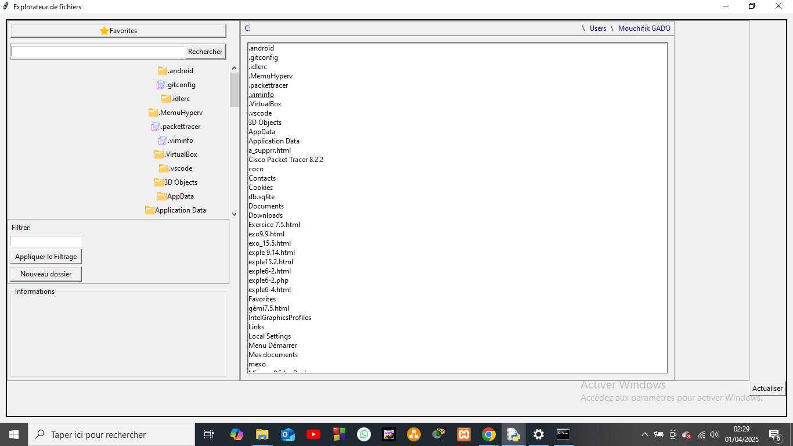
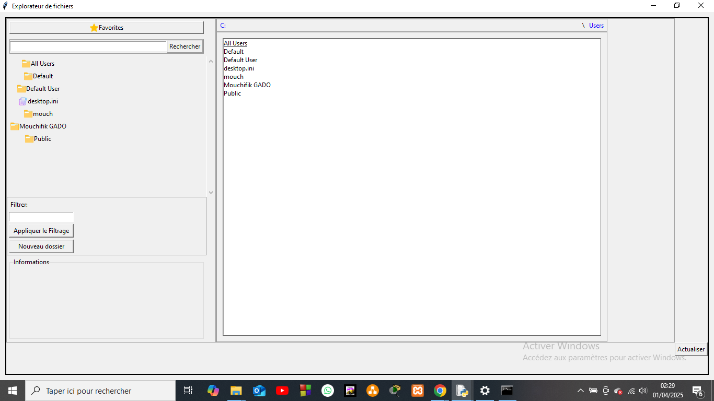
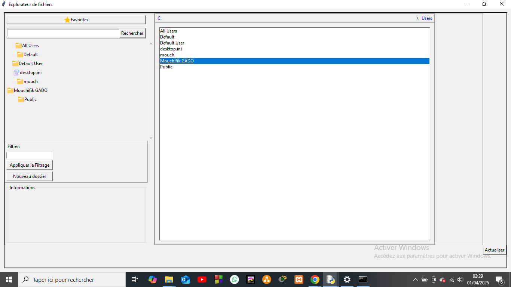
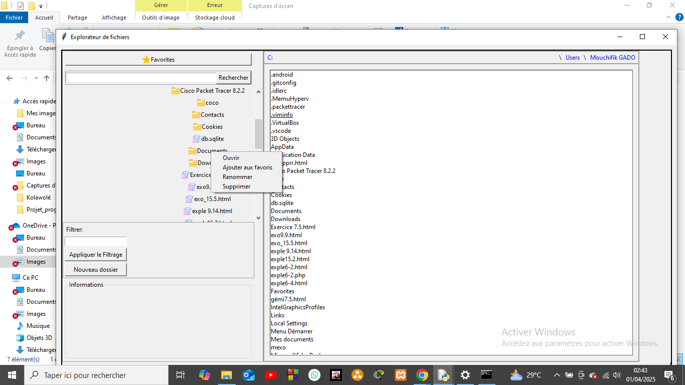

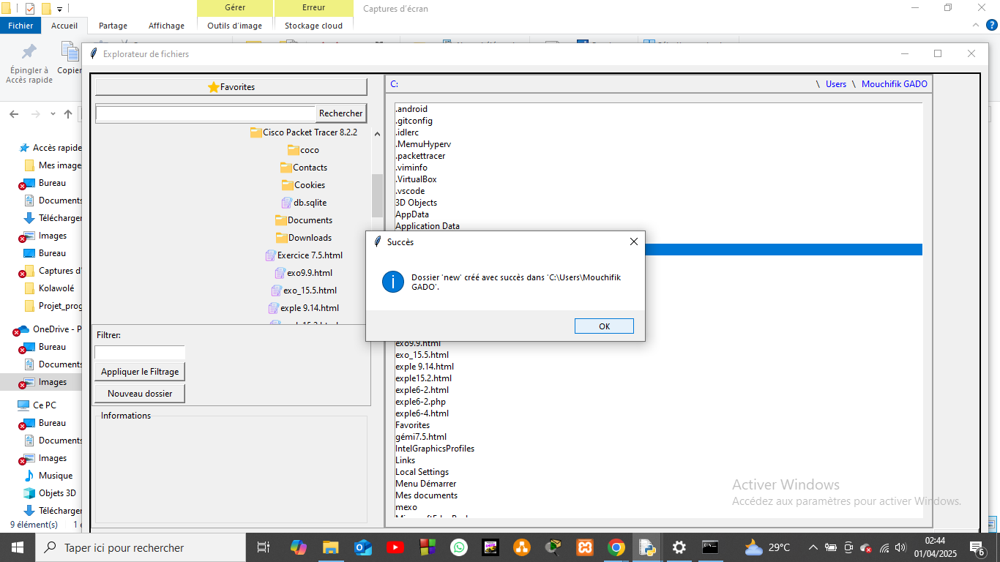
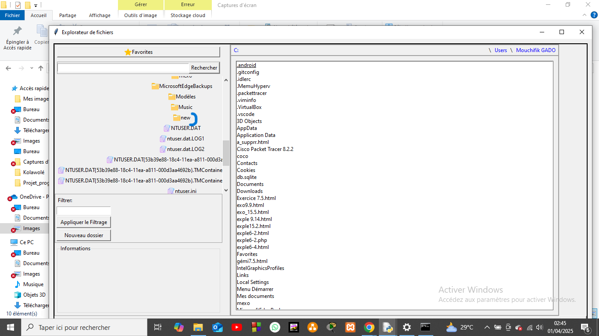
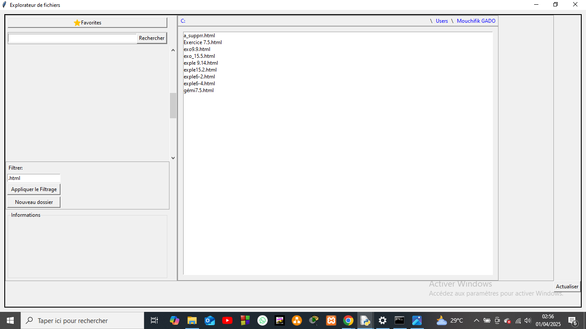
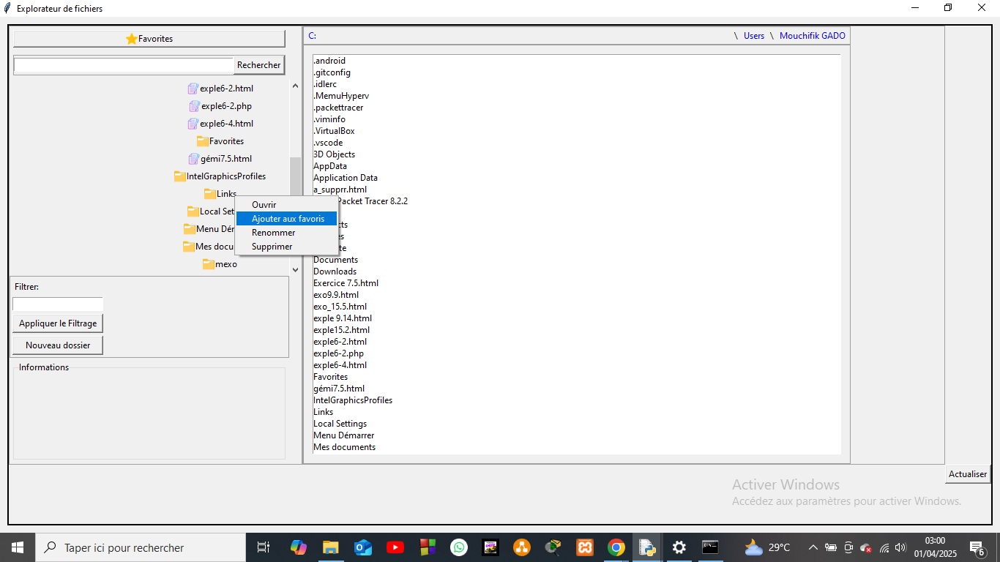
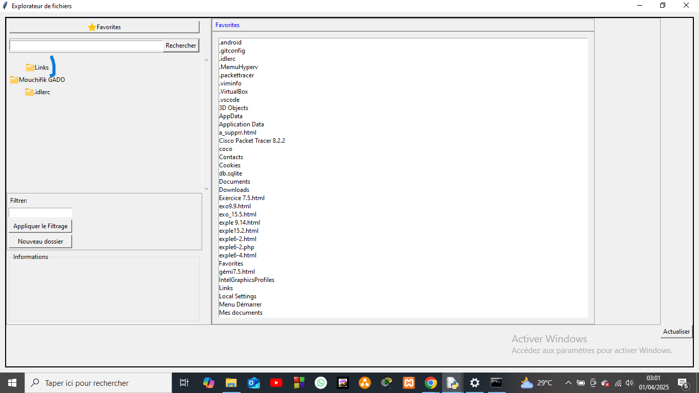
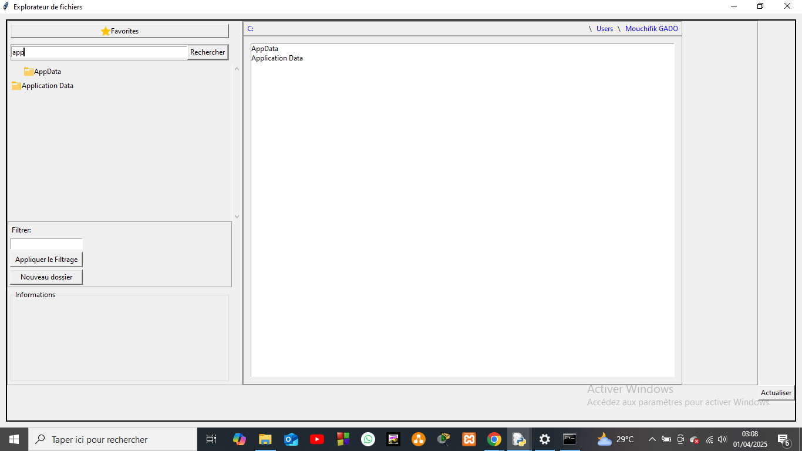
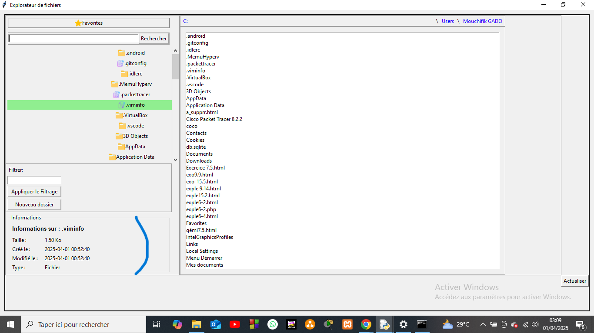
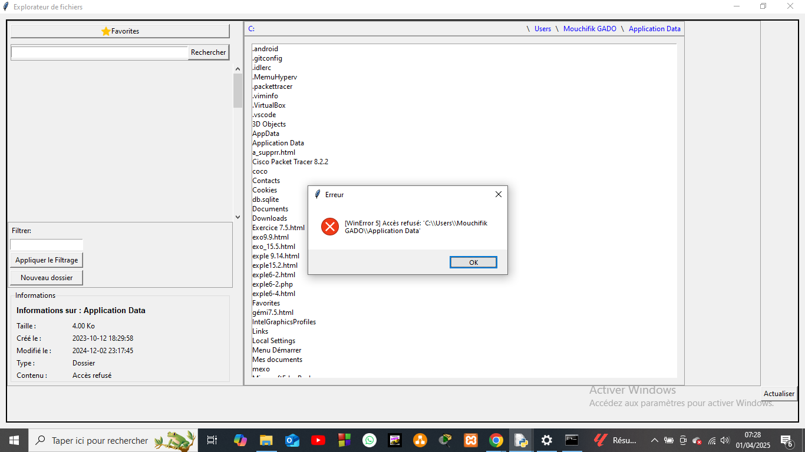
